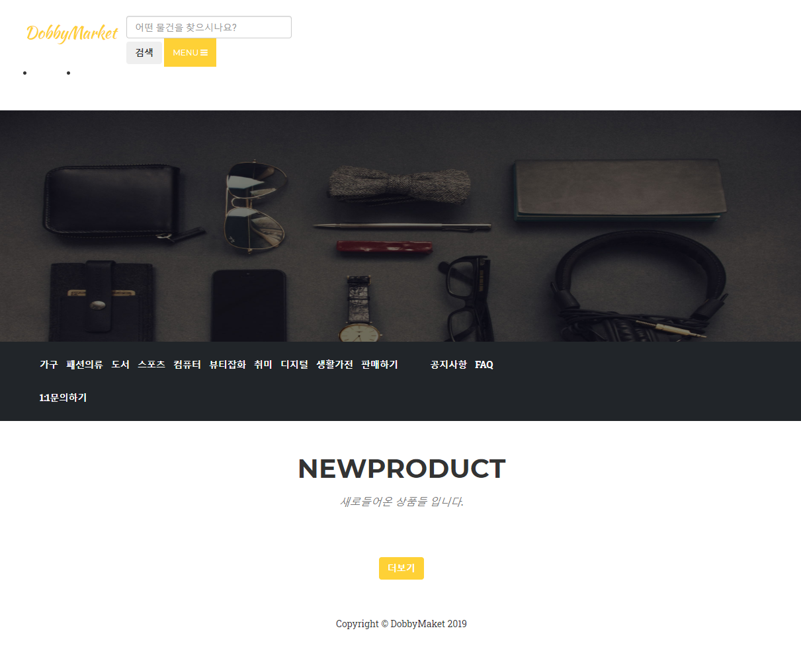
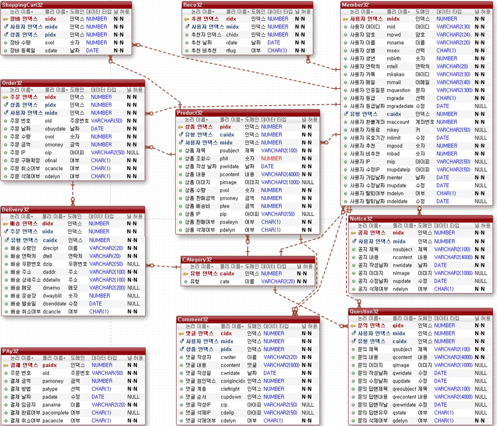

# team32 project (portFolio)
##### DobbyMarket
###### project name : DobbyMarket
---
### 소개
###### 사이트 소개
중고거래 사이트 도미 마켓은 가성비를 중시하는 20~30대의 합리적인 소비 행태 등을 배경으로    
국내 최대 중고거래 플랫폼 중 하나인 '중고나라'같은 접근이 용이하면서    
누구나 쉽게 거래를 할 수 있는 온라인 거래 사이트를 목표로 만들었습니다
###### 작업 기간
시작 : 19.02.10
끝 : 19.03.28
###### 기술 스택
+ FrontEnd
  + HTML
  + CSS
  + JavaScript
+ BackEnd
  + Java
+ DBMS
  + Oracle
  + MySQL
+ Tool
  + Sptring
  + SQL Developer
##### 프로젝트 화면

##### DB 다이어그램

